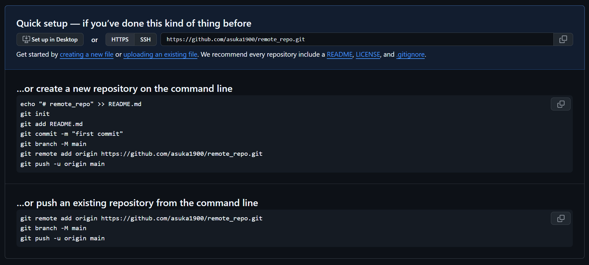

# Git分布式版本控制工具

## 一，Git的安装与基本配置

### 1. 下载与安装

下载地址：https://git-scm.com/


点击download for windows，下载64-bit-setup

下载完成后可得到如下安装文件：


双击开始安装，安装完成后在电脑桌面（或者其他任意目录）右键，如果看到如下两个菜单，则说明安装成功


### 2. 基本配置

- **配置用户名和邮箱**

便于在提交的时候识别出是谁提交的内容

```bash
git config --global user.name "xixi haha"
#引号的添加是因为用户名之间有空格，如果你的用户名没有空格，则引号可以省略
git config --global user.email 2325223070@qq.com

#保存用户名和密码
git config --global credential.helper store
#查看git的配置信息
git config --global --list
```


## 二，基本的Linux命令

### **文件和目录操作**

1. **`ls`**：列出目录内容

   ```
   ls          # 列出当前目录内容
   ls -l       # 详细列表
   ls -a       # 显示隐藏文件
   ```

2. **`cd`**：切换目录

   ```
   cd /path/to/directory  # 切换到指定目录
   cd ..                 # 返回上一级目录
   cd ~                  # 切换到用户主目录
   ```

3. **`pwd`**：显示当前工作目录

   ```
   pwd
   ```

4. **`mkdir`**：创建目录

   ```
   mkdir dirname         # 创建目录
   mkdir -p dir1/dir2    # 递归创建目录
   ```

5. **`rm`**：删除文件或目录

   ```
   rm file.txt           # 删除文件
   rm -r dirname         # 递归删除目录
   rm -f file.txt        # 强制删除（不提示）
   ```

6. **`cp`**：复制文件或目录

   ```
   cp file1 file2        # 复制文件
   cp -r dir1 dir2       # 递归复制目录
   ```

7. **`mv`**：移动或重命名文件/目录

   ```
   mv file1 file2        # 重命名文件
   mv file1 /path/to/dir # 移动文件
   ```

8. **`touch`**：创建空文件或更新文件时间戳

   ```
   touch file.txt
   ```

9. **`cat`**：查看文件内容

   ```
   cat file.txt
   ```

10. **`more` / `less`**：分页查看文件内容

    ```
    more file.txt
    less file.txt
    ```

11. **`head` / `tail`**：查看文件开头或结尾

    ```
    head -n 10 file.txt  # 查看前10行
    tail -n 10 file.txt  # 查看最后10行
    tail -f file.txt     # 实时查看文件更新
    ```

12. **`find`**：查找文件

    ```
    find /path -name "*.txt"  # 查找指定类型的文件
    ```

13. **`grep`**：搜索文件内容

    ```
    grep "keyword" file.txt   # 搜索包含关键字的行
    grep -r "keyword" /path   # 递归搜索目录
    ```

14. echo:

    ```
    echo "这是第一个文件" > file1.txt
    ```

    

------

### **系统信息**

1. **`uname`**：显示系统信息

   ```
   uname -a  # 显示所有系统信息
   ```

2. **`df`**：查看磁盘使用情况

   ```
   df -h     # 以易读格式显示
   ```

3. **`du`**：查看目录占用空间

   ```
   du -sh /path  # 显示目录总大小
   ```

4. **`top` / `htop`**：查看系统进程和资源使用情况

   ```
   top
   htop
   ```

5. **`ps`**：查看进程状态

   ```
   ps aux       # 显示所有进程
   ```

6. **`free`**：查看内存使用情况

   ```
   free -h      # 以易读格式显示
   ```

------

### **权限管理**

1. **`chmod`**：修改文件权限

   ```
   chmod 755 file.txt  # 设置权限为 rwxr-xr-x
   chmod +x script.sh  # 添加可执行权限
   ```

2. **`chown`**：修改文件所有者

   ```
   chown user:group file.txt
   ```

3. **`sudo`**：以超级用户权限执行命令

   ```
   sudo command
   ```

------

### **网络操作**

1. **`ping`**：测试网络连接

   ```
   ping google.com
   ```

2. **`ifconfig` / `ip`**：查看网络接口信息

   ```
   ifconfig
   ip addr show
   ```

3. **`ssh`**：远程登录

   ```
   ssh user@hostname
   ```

4. **`scp`**：远程复制文件

   ```
   scp file.txt user@hostname:/path/to/destination
   ```

5. **`wget` / `curl`**：下载文件

   ```
   wget https://example.com/file.zip
   curl -O https://example.com/file.zip
   ```

------

### **压缩和解压**

1. **`tar`**：打包和解包文件

   ```
   tar -cvf archive.tar /path  # 打包
   tar -xvf archive.tar        # 解包
   tar -czvf archive.tar.gz /path  # 打包并压缩
   tar -xzvf archive.tar.gz    # 解压
   ```

2. **`gzip` / `gunzip`**：压缩和解压文件

   ```
   gzip file.txt       # 压缩
   gunzip file.txt.gz  # 解压
   ```

3. **`zip` / `unzip`**：压缩和解压 ZIP 文件

   ```
   zip archive.zip file.txt
   unzip archive.zip
   ```

------

### **其他常用命令**

1. **`echo`**：输出文本

   ```
   echo "Hello, World!"
   ```

2. **`date`**：显示当前日期和时间

   ```
   date
   ```

3. **`history`**：查看命令历史

   ```
   history
   ```

4. **`man`**：查看命令手册

   ```
   man ls
   ```

5. **`alias`**：创建命令别名

   ```
   alias ll='ls -la'
   ```

## 三，Git命令

**Git工作流程图**


命令如下： 

1. clone（克隆）：从远程仓库中克隆代码到本地仓库ls
2. checkout（检出）：从本地仓库中检出一个分支然后进行修订
3. add（添加）：在提交前先将代码提交到暂存区
4. commit（提交）：提交到本地仓库，本地仓库中保存修改的各个历史版本
5. fetch（抓取）：从远程库抓取到本地仓库，不进行任何的合并操作，一般操作比较少
6. pull（拉取）：从远程库拉到本地库，自动进行合并(merge)，然后放到工作区，相当于fetch + merge
7. push（推送）：修改完成后，需要和团队成员共享代码时，将代码推送到远程仓库

### 1.获取本地仓库

1. 进入任何一个空目录，打开gitbash here
2. 执行命令git init
3. 如果创建成功后可在文件夹下看到隐藏的git目录

### 2.基础操作指令


#### 2.1.查看修改的状态（status）

- 作用：查看修改的状态（暂存区，工作区）
- 命令形式：git status

对git而言文件有4种状态：

untrack：新创建的还没有被Git管理起来的文件

unmodified: 已经被Git管理起来，但文件内容还没有发生改变

modified: 已经修改了的文件，但还没有添加到暂存区里

staged：修改之后并且已经添加到暂存区内的文件


#### 2.2.添加工作区到暂存区（add）

- 作用：添加工作区一个或多个文件的修改到暂存区

- 命令形式：git add 单个文件名|通配符

  ```
  #通配符是*，将工作区中所有.txt文件加入到暂存区
  git add *.txt
  #将当前文件夹下的所有文件都添加到暂存区
  git add .
  
  ```

#### 2.3.提交暂存区到本地仓库（commit）

- 提交暂存区内容到本地仓库的当前分支
- 命令形式：git commit -m "注释内容"

如果不适用-m参数，则会进入一个交互式的页面，默认使用vim来编辑注释信息

#### 2.4.查看提交日志（log）

- 作用：查看提交记录
- 命令形式：git log [option]
  - option
    - --all 显示所有分支
    - --pretty=oneline 将提交信息显示为一行
    - --abbrev-commit 是的输出的commited跟简短
    - --graph 以图的形式显示

#### 2.5.回退版本(reset)

- 三种模式

1. **git reset --soft**

回退到某一个版本，保留工作区和暂存区的所有修改内容

2. **git reset --hard**

回退到某一个版本，丢弃工作区和暂存区的所有修改内容

3. **git reset --mixed**（默认）

回退到某一个版本，只保留工作区的修改内容，并丢弃暂存区的修改内容


演示：

```
#新建一个仓库
git init repo
cd repo
#添加几次提交内容
echo 
echo
echo
add
commit
add
commit
add
commit
#使用git log --oneline查看提交历史
#再打开一个终端，将仓库目录复制3份，分别来执行三种不同的参
cd d 
cd git_learning

cp -rf repo repo-soft
cp -rf repo repo-hard
cp -rf repo repo-mixed
```

**命令分解**

1. **`cp`** ：
   - `cp` 是 Linux/Unix 系统中的复制命令，用于将文件或目录从一个位置复制到另一个位置。
2. **`-r`** ：
   - `-r` 表示递归（recursive），用于复制目录及其内部的所有内容（包括子目录和文件）。
   - 如果目标是一个目录，`-r` 会确保整个目录结构被完整复制。
3. **`-f`** ：
   - `-f` 表示强制（force），在复制过程中不会提示确认。
   - 如果目标文件已存在，`-f` 会直接覆盖目标文件，而不会询问用户。
4. **`repo`** ：
   - 这是源目录或文件的名称，表示要复制的内容。
5. **`repo-soft`** ：
   - 这是目标目录或文件的名称，表示复制后的内容存放的位置。

```
#cd repo-soft
git reset --soft 版本id(第二次提交)
#查看提交历史'
git log --oneline
#使用ls命令查看工作区的内容
#查看暂存区的内容
git ls-files
#查看仓库状态
git status
```

```
cd ..
cd repo-hard
#使用HEAD^ 回退到上一个版本
git reset --hard HEAD^

```

```
cd ..
cd repo-mixed
git reset HEAD^
```

**谨慎使用hard参数**

但不要担心，git中的所有操作都是可以回溯的

可以使用**git reflog**命令查看我们操作的历史记录，找到误操作之前的版本号，再使用git reset命令回退到这个版本就可以了

#### 2.6.查看差异(diff)


git diff后如果没有其他参数，会默认比较的是工作区和暂存区之间的差异内容，它会显示发生更改的文件已经更改的详细信息

```
vi 3.txt
```


warning 一行不用管

diff一行会告诉我们发生变更的文件

红色文字表示删除的内容，绿色文字表示添加的内容，这里比较的是工作区和暂存区的差异

**比较工作区和版本库之间的差异**

```
git diff HEAD
```

**比较暂存区和版本库之间的差异**

```
git diff --cached
```

**比较两个特定版本之间的差异**

```
git diff 版本号1 版本号2
```

**比较当前版本和上一个版本之间的差异**

```
git diff HEAD~ HEAD
git diff HEAD~2 HEAD  #2表示HEAD之前两个版本
```

#### 2.7.删除文件(remove)

```
#查看本地仓库中的内容
ls -ltr
```

git rm 2.txt     #将工作区和暂存区的指定文件都删除


#### 2.8.（.gitignore)忽略文件


### 3.远程仓库

#### 3.1.SSH配置

1. **首先注册github账号**

2. **在github上创建远程仓库**



3. **配置SSH密钥**

将gitbash退回到根目录，

```
cd .ssh
#生成SSH密钥
ssh-keygen -t rsa -b 4096
```


如果是第一次使用这个命令，直接enter，它会在我们用户根目录的.ssh目录下生成一个id_rsa的密钥文件

如果之前已经生成过id_rsa这个密钥文件，再次回车的话会覆盖掉之前的密钥文件，这个操作是不可逆的，这时就要输入一个新的文件名

设置密码：**asuka**

注意，设置密码时内容不回显


查看一下本地目录会发现刚刚的操作生成了两个新文件，没有任何扩展名的是私钥文件，谁也不要泄露；有.pub扩展名的是公钥文件，要上传到GitHub

```
#打开公钥文件，复制其内容
vi id_rsa.pub
```

进入GitHub主页，找到setting,然后再找到SSH and GPG keys


点击进入，点击New SSH key,将刚刚复制的公钥内容复制到下面的输入框中，再输入任意title，点击add ssh key，

这样我们就成功把公钥添加到GitHub上面

如果你有多个密钥文件，则需要做如下配置


意思是当我们访问github.com的时候，指定使用ssh下的test密钥

4. 克隆仓库

注意clone仓库的时候要克隆到想要的目录，不要直接在.ssh/目录下执行

克隆地址在官网的主页如下


```
git clone git@github.com:asuka1900/remote_repo.git
```

在首次连接GitHub服务器时需要验证身份，如下：


直接输入yes，并回车就好


#### 3.2.**关联本地仓库和远程仓库**

```
git remote add origin git@github.com:asuka1900/remote_repo.git
git branch -M main
git push -u origin main
```

获取远程仓库的内容

```
git pull
git fetch
```

git pull会自动对拉取的文件和本地的文件进行一次合并，如果有冲突，则需手动合并

### 4.在VScode中使用Git

- vscode支持直接从命令行启动

我们可以在仓库的目录下面输入`code .`，意思是在当前目录打开vscode


### 5.分支

```
#查看当前仓库的所有分支
git branch
#创建新的分支
git branch 分支名
#切换到不同分支
git checkout 分支名
```

注意:git checkout 命令还可以用于恢复文件，但如果我们的分支名和文件名相同的话，使用git checkout命令优先是切换分支，而不是恢复文件，为了避免这种歧义，推出了专门用于切换分支的命令：`git switch`

```
git switch 分支名
```

在切换分支后，工作区的文件会发生变化

```
git merge 将要被合并的分支
```

当前所在的分支就是合并后的目标分支

```
#删除已经被合并的分支
git branch -d 分支名
#删除未被合并的分支
git branch -D 分支名
```


## 四，Warning in Git

- **warning: in the working copy of 'file1.txt', LF will be replaced by CRLF the next time Git touches it**

- 当你看到类似以下警告时：

  warning: in the working copy of 'file1.txt', LF will be replaced by CRLF the next time Git touches it

  这意味着当前文件 

  ```
  file1.txt
  ```

   的换行符是 LF（Unix 风格），但根据你的 Git 配置（通常是 

  ```
  core.autocrlf=true
  ```

  ），Git 将在下次操作时将其转换为 CRLF（Windows 风格）。


